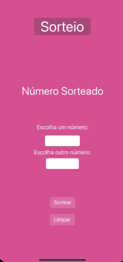
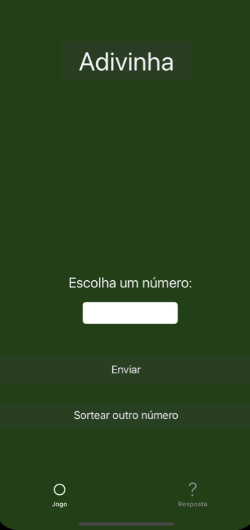
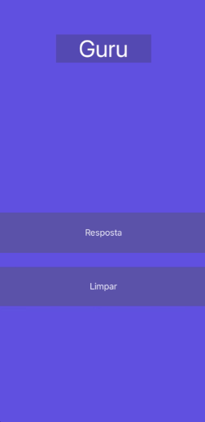
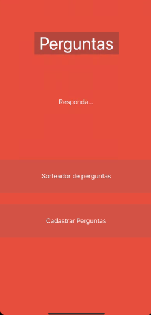

# # Estudo de Jogos em Swift

Este repositório contém um estudo de jogos desenvolvidos em Swift como parte do projeto realizado no Instituto Federal de Brasília.

## Jogos

### Jogo de Sorteio

- **Descrição:** Este jogo permite ao usuário inserir um intervalo de números e, em seguida, sorteia um número aleatório dentro desse intervalo.
- **Tecnologias Usadas:** Swift, UIKit.
- **Instruções de Uso:** Para jogar, preencha os campos de número inicial e final e pressione o botão "Sortear". O número sorteado será exibido na tela.

### Jogo da Adivinhação

- **Descrição:** Neste jogo, o usuário tenta adivinhar um número aleatório. O jogo fornece dicas sobre se o número a ser adivinhado é maior ou menor do que a suposição do jogador.
- **Tecnologias Usadas:** Swift, UIKit.
- **Instruções de Uso:** Insira um número e pressione o botão "Adivinhar". O jogo fornecerá dicas e indicará se a suposição está correta.

### Jogo do Guru

- **Descrição:** Este jogo envolve receber respostas aleatórias do "Guru" para perguntas de sim ou não.
- **Tecnologias Usadas:** Swift, UIKit.
- **Instruções de Uso:** Pressione o botão "Sortear" para receber uma resposta do Guru. O jogo fornece respostas aleatórias.

### Jogo de Perguntas

- **Descrição:** Este jogo oferece uma série de perguntas triviais aleatórias. O usuário pode pressionar o botão "Sortear" para obter uma pergunta aleatória.
- **Tecnologias Usadas:** Swift, UIKit.
- **Instruções de Uso:** Pressione o botão "Sortear" para receber uma pergunta aleatória. O jogo possui um banco de perguntas predefinido.

## Estrutura do Projeto

- O projeto está organizado em vários arquivos e classes, cada um correspondendo a um jogo específico.

## Requisitos

- Este projeto foi desenvolvido usando Swift e requer um ambiente de desenvolvimento iOS, como o Xcode, para ser compilado e executado.

## Como Instalar

- Clone a branch master deste repositório em sua máquina local.
- Abra o projeto no Xcode.
- Compile e execute os jogos no simulador ou em um dispositivo iOS.

## Contato

Se você desejar entrar em contato para perguntas ou colaborações, você pode me encontrar em [liscandeia523@gmail.com] ou [(https://github.com/liscandeia)].
